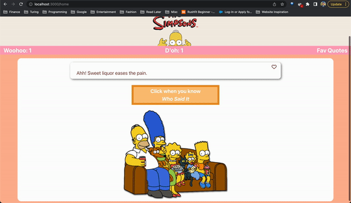
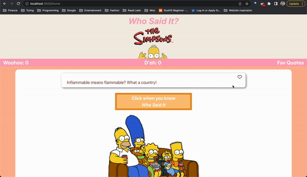

# Who Said It?
## The Simpsons Edition

The Who Said It? Simpsons Edition application is currently deployed [here](https://rlh-who-said-it-simpsons-ed.surge.sh/)

Welcome to the Who Said It? application, the Simpsons edition!

This app is aimed towards new fans, friends/family/significants of Simpsons fans, or just anyone in particular, who wish to test their knowledge of quotes from the show.

## Setup

If you would like to run the application locally you would need to:

1. Clone down the Repo
2. `cd` into the directory
3. Run `npm i` to install all dependencies
4. Run `npm start`, which will run the application on `localhost:3000/home`

## Goals
- Develop an MVP to demonstrate mastery of:
    * React
    * Router
    * Asynchronous JavaScript
    * End to End testing with Cypress
- Create a multi-page application implementing React Router that can be accessed by a single user
- Implement the ability to display quotes from [the Simpsons Quotes API](https://thesimpsonsquoteapi.glitch.me/) and allow users to play through the app (see gameplay below) and add/view/remove favorite quotes

## Gameplay

- The user is presented with a random Simpsons quote on the homepage
- Once the user believes they know which  character said the quote, they can click the "Click here when you know Who Said It" button
- The next page will display the Simpsons character who said the quote
- If the user guessed correctly, they can click Woohoo! and add 1 point to their Woohoo score
- If the user guessed incorrectly, they can click D'oh! and add 1 point to their D'oh score

## Favoriting Quotes

- If the user wishes to favorite a quote, they can click the heart icon in the upper right-hand corner of the quote window
- Once clicked, the heart will change to a checkmark
- The user can then click on Fav Quotes to navigate to the Favorite Quotes page
- Here the user can view their favorite quotes
- If a user wishes to delete a quote, they can click the X button in the upper right-hand corner of the quote window to remove it

## Potential Extentions

- Allow the user to sign in and see their stats for the game
- Offer multiple choice options for the gameplay
- The ability for a user to upload their own Simpsons quotes and characters

## Authors

- Ron L Head - [GitHub](https://github.com/RonLHead)
